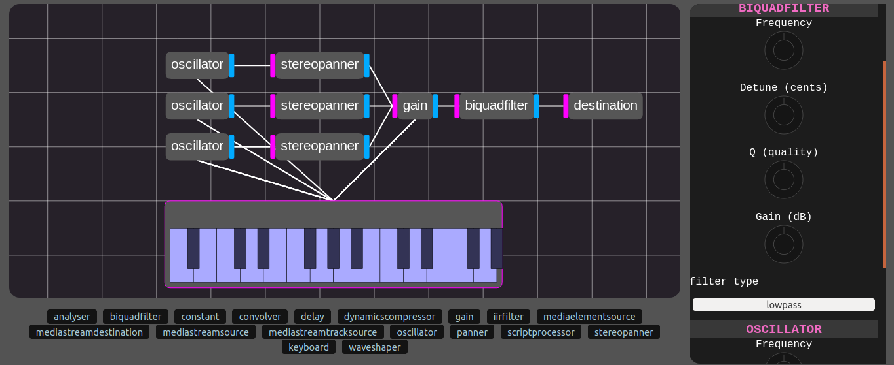

# Web Audio Workstation
An experiment project for designing audio using the Web Audio API

## Implemented features
- Unlimited scalable/pannable grid
- Node creation, placement, connections
- Node config panel (mostly implemented)
- Generic keyboard (mostly implemented)
- Fancy knobs (mostly implemented)

## Planned features
- Instrument / component JSON save files w/ import
- Node grouping
- External audio file loading
- Microphone / System sound access
- Audio rendering with OfflineAudioContext
- Script nodes w/ autocomplete
- Visual analysers
- Visual graph/knob based filters/eq decks
- ESModule plugins
- Extensible input events

## Input
- Connect the output of one node to another by holding CTRL + Right-click on the node you want output from then right-clicking the node you want to plug it into. If the two are already connected, this action will disconnect them.

- Drag a node using left mouse button (0)
- Open a node's config in the side using right mouse click on the node
- Open multiple node configs at once by holding ALT while right-clicking nodes
- Pan around by dragging left mouse button (0) over empty space, or while holding ALT key
- Zoom using the mouse wheel

Tips:
Need to drag a node and pan scene at the same time? 
Drag a node, then hold alt and drag the scene without lifting the mouse 
Then release alt and continue dragging the node!